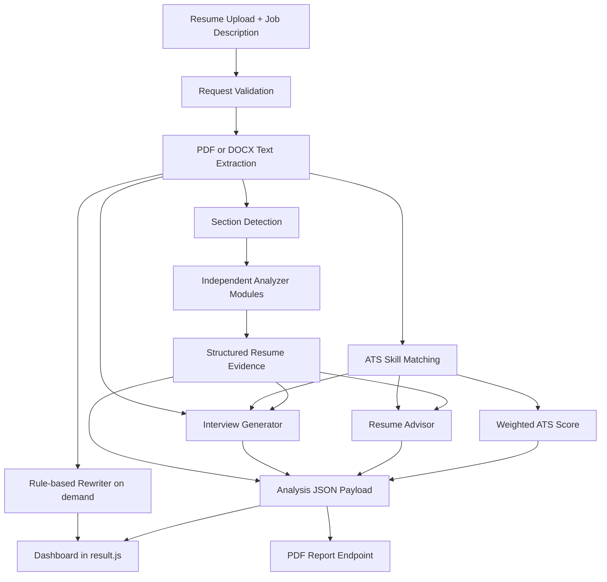

# ResumeIQ Architecture

## Architectural Style

ResumeIQ is a Flask application with a deterministic analysis pipeline and a vanilla HTML/CSS/JavaScript frontend. The backend runs existing analyzer modules once per upload and assembles a JSON-safe analysis result. The browser renders that result as a continuous dashboard and calls separate endpoints for rule-based rewriting and PDF generation.

## Complete Data Flow

The practical sequence is:

**Resume Upload -> Resume Parsing -> Section Detection -> ATS Analysis -> JD Matching -> Analyzer Modules -> Resume Evidence -> Advisor -> Skills Intelligence -> Rewriter -> Interview Generator -> Dashboard -> PDF Report**

## Backend Responsibilities

### `app.py`

- Creates the Flask application.
- Configures the upload directory and 16 MB request limit.
- Validates upload requests and file extensions.
- Extracts PDF or DOCX text.
- Orchestrates the existing analyzer modules in `build_analysis_result()`.
- Returns the complete `/upload` analysis payload.
- Serves `/rewrite` for on-demand rewriting.
- Serves `/generate_pdf` for static ReportLab reports.
- Serves `/health` and page routes.
- Returns JSON errors for oversized requests and API validation failures.

### `resume_parser.py`

Uses PyPDF2 to extract text from PDF pages. DOCX extraction is handled in `app.py` with the standard library ZIP/XML APIs.

### `section_detector.py`

Detects the presence of major resume sections such as Education, Experience, Projects, Skills, and Certifications using deterministic keyword and heading checks.

### Analyzer Modules

Each analyzer receives resume text and returns structured data:

- `contact_analyzer.py`: email, phone, profile, and contact values.
- `education_analyzer.py`: degree, branch, institution, CGPA, and education presence.
- `experience_analyzer.py`: internships, roles, companies, and experience presence.
- `project_analyzer.py`: project count and project categories.
- `certification_analyzer.py`: certification groups and totals.
- `achievement_analyzer.py`: achievements, metrics, and impact signals.
- `language_analyzer.py`: programming, scripting, markup, and natural languages.
- `formatting_analyzer.py`: length, layout signals, issues, strengths, and formatting score.

### `ats_engine.py`

Matches known skills between the resume and JD. It returns the existing skill-match percentage, matched skills, and missing skills. Related technologies can receive partial credit while remaining visible as related rather than fully exact.

### `score_engine.py`

Calculates the existing weighted 100-point ATS result from skill matching and analyzer outputs. The categories are Skills 40, Projects 15, Experience 15, Education 10, Sections 10, and Formatting 10.

### `resume_evidence.py`

Builds traceable records containing values, evidence type, logical section, source text, and source metadata. It records projects, technologies, skills, experience, education, certifications, achievements, languages, metrics, and dates.

### `resume_advisor.py`

Creates structured recommendations with priority, section, source, evidence, JD relevance, description, and factual-safety metadata. Missing JD skills are described as unsupported requirements and are not presented as candidate skills.

### `resume_rewriter.py`

Provides a deterministic rule-based rewrite provider. It extracts supported sections, changes wording only where safe, preserves exact Original text, and validates factual tokens before returning results. Unsupported proposed facts are reverted to the original wording.

### `interview_generator.py`

Creates prioritized questions from project evidence, role/employer source lines, technologies, education, certifications, achievements, JD gaps, and generic behavioral prompts. JD-gap questions are marked as job-description questions and do not assume experience.

### PDF Generation

`generate_pdf_report()` in `app.py` creates a ReportLab document from the structured analysis payload. User-controlled values are ASCII-normalized and XML-escaped before being placed in PDF paragraphs.

## Frontend Responsibilities

### `templates/base.html`

Provides the shared navigation, theme controls, modal, stylesheet, and script loading.

### `templates/index.html`

Provides the upload form, drag-and-drop area, JD textarea, progress state, and client-side validation surface.

### `templates/result.html`

Defines the continuous dashboard structure:

- Resume Overview.
- Resume Health.
- ATS / JD Match.
- Strengths.
- Priority Improvements.
- Skills Intelligence.
- Resume Rewriter.
- Interview Preparation.
- Remaining Recommendations.
- Secondary Resume Details.
- Download Report.

### `static/js/script.js`

Handles home-page theme controls, upload validation, form submission, session storage, and redirect to the result page.

### `static/js/result.js`

Reads the stored analysis payload, escapes dynamic content, renders scores, health values, skill categories, evidence-backed recommendations, interview questions, resume details, and formatting data. It loads rewriting lazily with `/rewrite`, supports copy actions, provides anchor navigation, and sends the payload to `/generate_pdf`.

### `static/css/style.css`

Contains the shared visual system and focused responsive styles for the dashboard, health summary, Skills groups, secondary details, rewrite cards, interview questions, navigation, and print behavior.

## Data Contract

The `/upload` response includes the existing analysis fields, including:

- `overall_ats_score`
- `score_breakdown`
- `matched_skills`
- `missing_skills`
- analyzer result objects
- `resume_evidence`
- `recommendation_details`
- `suggestions`
- `interview_questions`
- `resume_text`
- `job_description_present`

The frontend stores this payload in `sessionStorage` for the result page. Rewriter output is intentionally separate and is not added to the static PDF contract.

## Safety Boundaries

Resume text is treated as data. Uploads are allowlisted, filenames are normalized, temporary files are removed after extraction, dynamic HTML is escaped, PDF paragraph content is XML-escaped, and unsupported JD skills remain unsupported throughout evidence, advice, rewriting, and interview generation.
